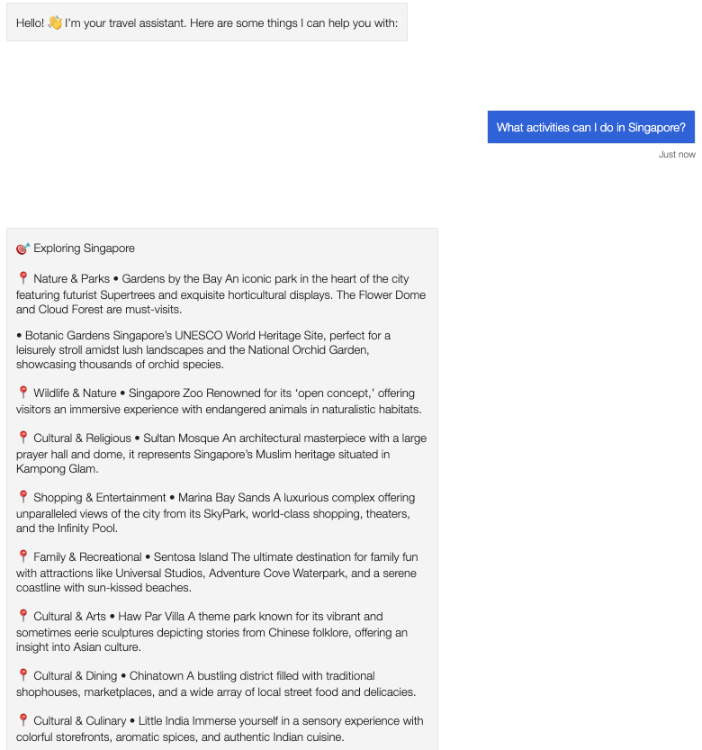
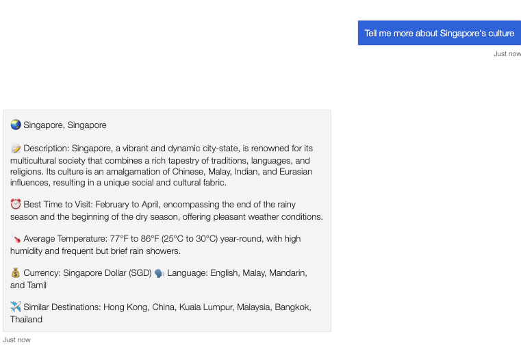

# Travel Autogen Bot Framework

Demonstrate the core capabilities of the Microsoft Bot Framework

This bot has been created using [Bot Framework](https://dev.botframework.com), it shows how to create a simple bot that accepts input from the user and echoes it back.


# Travel Assistant Bot with AutoGen Integration

A sophisticated travel assistant chatbot built using Microsoft's Bot Framework and AutoGen, featuring real-time AI interactions through WebSocket connections.

<div style="display: flex; justify-content: space-between;">
    
    
</div>

## Features

- **Real-time AI Responses**: Integrates with AutoGen for intelligent travel recommendations and information
- **Multi-channel Support**: Works seamlessly on Microsoft Teams and Bot Framework Emulator
- **Interactive UI**: Features suggested action buttons for common queries
- **Structured Information Display**: Formatted responses for various types of travel information:
  - Destination details and cultural information
  - Local activities and attractions
  - Food recommendations
  - Travel timing suggestions

## Architecture

- **Bot Framework Core**: Handles message processing and channel integration
- **WebSocket Integration**: Real-time communication with AutoGen backend
- **Azure Web PubSub**: Manages WebSocket connections and message routing
- **Structured Message Handling**: Formats different types of travel information for optimal display

## Message Types Supported

1. **Destination Information**
   - City and country details
   - Best time to visit
   - Weather information
   - Currency and language
   - Similar destinations

2. **Activities Information**
   - Categorized activities (Attractions, Hidden Gems, Family-Friendly, etc.)
   - Detailed descriptions
   - Location-specific recommendations

3. **Cultural and Food Information**
   - Local cuisine recommendations
   - Cultural highlights
   - Historical sites

## Prerequisites

- Python 3.6 or higher
- Azure account for Web PubSub service
- Bot Framework Emulator (for local testing)

## Setup and Installation

1. **Install Dependencies**
```bash
pip install -r requirements.txt
```

2. **Environment Configuration**
Create a `.env` file with:
```
WEBPUBSUB_CONNECTION_STRING1=your_connection_string
```

3. **Run the Bot**
```bash
python app.py
```

## Local Testing

1. Install [Bot Framework Emulator](https://github.com/microsoft/botframework-emulator)
2. Connect to `http://localhost:3978/api/messages`
3. Start chatting with the travel assistant

## Teams Integration

The bot is fully compatible with Microsoft Teams, providing:
- Interactive message cards
- Suggested actions
- Rich text formatting
- Emoji support

<div style="display: flex; justify-content: space-between;">
    
    
</div>

## Project Structure

```
├── app.py                 # Main application entry point
├── bot.py                 # Bot logic and message handling
├── bot_handler.py         # Bot Framework message processing
├── websocket_handler.py   # WebSocket connection management
└── data_types.py         # Message type definitions
```

## Key Components

- **Bot Handler**: Manages incoming messages and channel interactions
- **WebSocket Handler**: Maintains real-time connection with AutoGen
- **Message Formatter**: Structures responses for optimal display
- **Suggested Actions**: Provides interactive buttons for common queries

## Future Enhancements

- Integration with flight booking systems
- Hotel recommendations
- Itinerary planning
- Multi-language support
- User preference tracking

## Resources

- [Bot Framework Documentation](https://docs.botframework.com)
- [Azure Bot Service](https://azure.microsoft.com/services/bot-services/)
- [AutoGen Documentation](https://microsoft.github.io/autogen/)
- [Teams Integration Guide](https://docs.microsoft.com/microsoftteams/platform/)

## Prerequisites

This sample **requires** prerequisites in order to run.

### Install Python 3.6

## Running the sample
- Run `pip install -r requirements.txt` to install all dependencies
- Run `python app.py`


## Testing the bot using Bot Framework Emulator

[Bot Framework Emulator](https://github.com/microsoft/botframework-emulator) is a desktop application that allows bot developers to test and debug their bots on localhost or running remotely through a tunnel.

- Install the Bot Framework Emulator version 4.3.0 or greater from [here](https://github.com/Microsoft/BotFramework-Emulator/releases)

### Connect to the bot using Bot Framework Emulator

- Launch Bot Framework Emulator
- Enter a Bot URL of `http://localhost:3978/api/messages`


## Further reading

- [Bot Framework Documentation](https://docs.botframework.com)
- [Bot Basics](https://docs.microsoft.com/azure/bot-service/bot-builder-basics?view=azure-bot-service-4.0)
- [Dialogs](https://docs.microsoft.com/azure/bot-service/bot-builder-concept-dialog?view=azure-bot-service-4.0)
- [Gathering Input Using Prompts](https://docs.microsoft.com/azure/bot-service/bot-builder-prompts?view=azure-bot-service-4.0&tabs=csharp)
- [Activity processing](https://docs.microsoft.com/en-us/azure/bot-service/bot-builder-concept-activity-processing?view=azure-bot-service-4.0)
- [Azure Bot Service Introduction](https://docs.microsoft.com/azure/bot-service/bot-service-overview-introduction?view=azure-bot-service-4.0)
- [Azure Bot Service Documentation](https://docs.microsoft.com/azure/bot-service/?view=azure-bot-service-4.0)
- [Azure CLI](https://docs.microsoft.com/cli/azure/?view=azure-cli-latest)
- [Azure Portal](https://portal.azure.com)
- [Language Understanding using LUIS](https://docs.microsoft.com/azure/cognitive-services/luis/)
- [Channels and Bot Connector Service](https://docs.microsoft.com/azure/bot-service/bot-concepts?view=azure-bot-service-4.0)